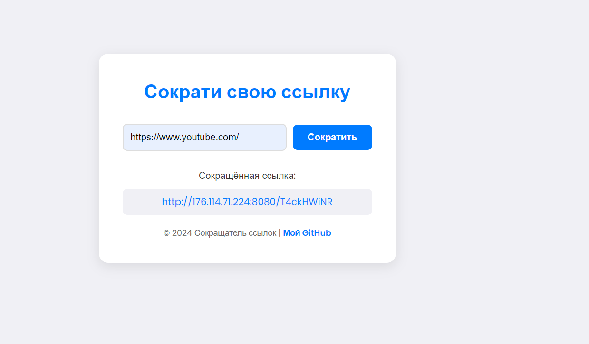

«Сервис сокращения URL».

## Начало работы

1. Склонируйте репозиторий в любую подходящую директорию на вашем компьютере.
2. В корне репозитория выполните команду `go mod init <name>` (где `<name>` — адрес вашего репозитория на GitHub без префикса `https://`) для создания модуля.

## Использование

Сервис сокращения URL должен иметь следующий функционал:

- Сокращение URL с помощью POST-запроса на `/shorten` с JSON-телом, содержащим поле `original` с URL для сокращения.
- Расширение сокращённого URL с помощью GET-запроса на `/<token>`, где `<token>` — токен сокращённого URL.

## Настройка и запуск

1. В файле .env пример настройки переменных окружения.
2. В папке nginx расположены настройки и статический контент для nginx сервера.
3. Так же приложение можно поднять используя docker-engine через команду `docker-compose up`.
4. В папке db_scripts лежат скрипты, которые стоит запустить при создании базы данных на сервере postgres, чтобы создать все нужные таблицы.

## Интерфейс

## Лицензия

Этот проект лицензируется под лицензией [MIT](LICENSE).
